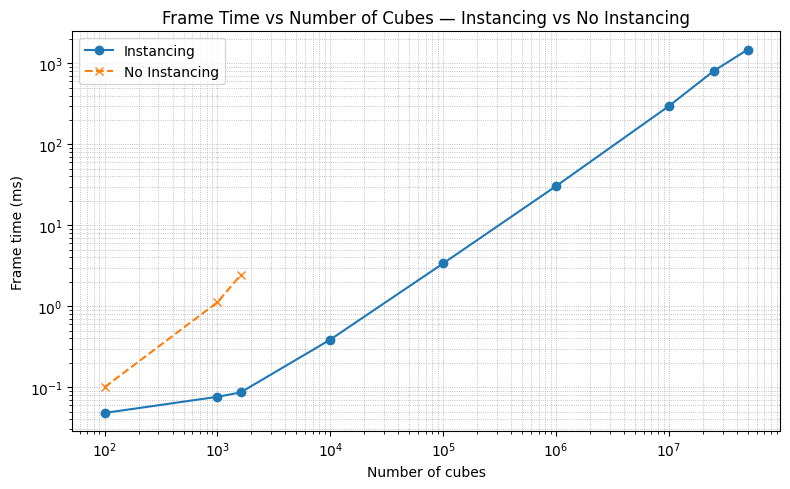
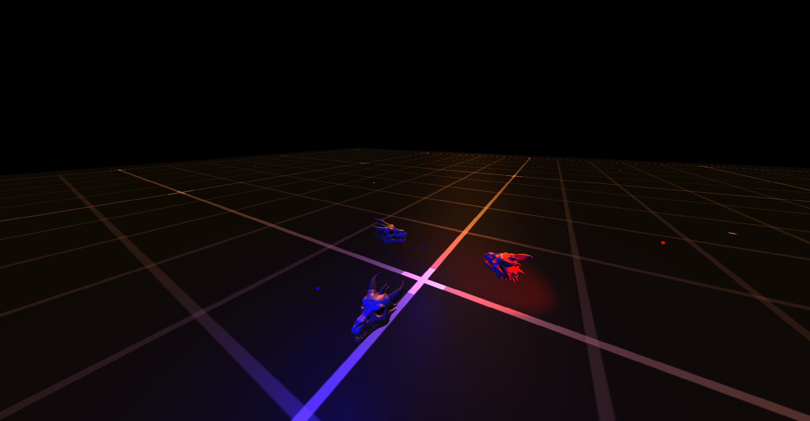
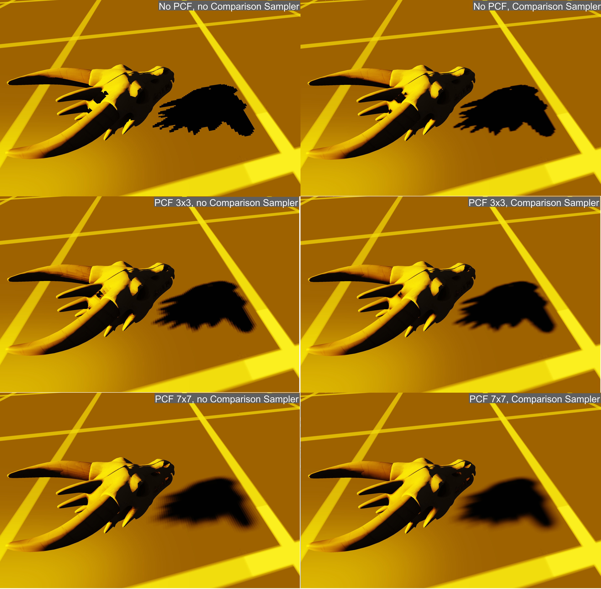
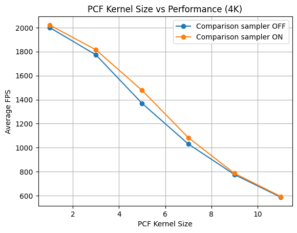

# Introduction to Real-Time Computer Graphics Labs

- **Author**: Artur Pelcharskyi
- **OS**: Windows 11
- **API**: DirectX11
- **Total Late Days**: 39

## Homework 1: A Funny Cube
- **Late Days**: 2
- **Demo**: [YouTube Video](https://www.youtube.com/watch?v=ZIw-_7JyE0U)

### Main tasks:
- Created a project window
- Implemented an Euler camera controlled via mouse and keyboard
- Handcrafted a cube
- Implemented two different pixel shaders

### Aditional tasks:
- Integrated complex shaders from ShaderToy: [Shader 1](https://www.shadertoy.com/view/Xd23Dh) and [Shader 2](https://www.shadertoy.com/view/lsl3RH)
- Added an FPS counter
- Implemented functionality to load textures from image files

## Homework 2: Instancing and Models
- **Late Days**: 1
- **Demo**: [YouTube Video](https://youtu.be/AWov3wH2uvc?si=aDZYS79XognPZDGZ)

### Main tasks:
- Implemented a **3D model loader** using **Assimp**
- Loaded and rendered a **textured 3D model** in the scene
- Implemented **instanced rendering** to draw **10000 textured cubes** distributed across the 3D world
- Added a large **ground plane** with a tileable texture
- Conducted **performance tests** comparing frame times for **instanced vs non-instanced** cube rendering and plotted the results

### Aditional tasks:
- Implemented a Mesh System to support instanced rendering for any imported 3D model (handling multiple meshes per model)
- Added a **separate transformation matrix** for objects, allowing them to move or rotate independently of the camera (real-time spinning/moving animation)
- Integrated **ImGui** to provide an interface for **moving and rotating** individual objects in the scene

### Instancing vs no instancing
- **Device**: Intel Core i9-14900K, NVIDIA RTX 5080
- **Scene**: Textured cubes rendered with and without GPU instancing.
- **Metric**: Frame time (ms) — lower is better.
- **Note**: “DNF” (Did Not Finish) indicates that the non-instanced rendering could not complete due to insufficient system memory (models didn’t fit into RAM).

| Number of Cubes | Frame Time (No Instancing) | Frame Time (Instancing) |
|------------------|----------------------------|--------------------------|
| 100              | 0.10 ms                   | 0.048 ms                 |
| 1,000            | 1.12 ms                   | 0.076 ms                 |
| 1,600            | 2.42 ms                   | 0.086 ms                 |
| 10,000           | DNF                       | 0.387 ms                 |
| 100,000          | DNF                       | 3.38 ms                  |
| 1,000,000        | DNF                       | 30.44 ms                 |
| 10,000,000       | DNF                       | 296.818 ms               |
| 25,000,000       | DNF                       | 806.425 ms               |
| 50,000,000       | DNF                       | 1480.738 ms              |

Also, you may find screenshots of experiments in `images`.

## Homework 3: Lighting
- **Late Days**: 3
- **Demo**: [YouTube Video](https://youtu.be/70v7atALN3Q?si=kHRVDou6XmYY8uId)

### Main Tasks
- Implement three types of lights: **Directional**, **Point**, and **Spot**.
- Add support for a **Phong** lighting system (disable Blinn when using this mode).
- Add support for a **Blinn–Phong** lighting system.

### Fixes
- The application now selects the **adapter with the largest VRAM** instead of the first available one.  
  This avoids using an integrated GPU when a discrete GPU is available.

### Comments
The scene consists of **four objects** (three skulls and one plane) and **four lights**:
- 1 × Directional light (yellow)
- 2 × Point lights (blue)
- 1 × Spot light (red)

### ImGui Parameters

#### Models
- Allows modifying the **rotation**, **scale**, and **position** of each skull model.

#### Light General
- **Show lights** – Toggles lighting in the scene.  
  When disabled, only **ambient lighting** remains.  
  When enabled, all **active lights** contribute to illumination.
- **Turn on Blinn** – Selects the lighting model:  
  - On → **Blinn–Phong**  
  - Off → **Phong**
- **Sphere radius** – Sets the radius of the sphere used to represent each light source.  
  (This parameter does *not* affect the actual light’s strength or range.)
- **Ambient color**, **strength**, and **light shine** behave as expected.

#### Individual Light Settings
- Each light type (Directional, Point, Spot) exposes its specific parameters,  
  such as **color**, **strength**, **position**, **attenuation**, and **angle**.

### Notes
- The **Directional light** sphere is not displayed because this type of light  
  depends only on direction, not position.
- **Light spheres** have their own pixel shader that ignores illumination from other sources.  
  Each sphere’s color matches the light it represents.  
  The **Spot light** sphere does not visualize the light’s direction.

## Homework 4: Shadows and Transparency
- **Late Days**: 33
- **Demo**: [YouTube Video](https://youtu.be/8u-lnADDS3o)

### Main tasks:
- Directional light shadow with PCF and Comparison Sampler
- Comparison of PCF on/off, Comparison Sampler on/off
- ImGUI
- Painter’s Algorithm

### Aditional tasks:
- Aditional support of spot light shadow
- Skybox
- Ability to enable/disable Comparison sampler, change PCF kernel size during the process
- Switch between camera and lights projection spaces that support shadows
- Ability to add/delete objects

### PCF and Comparison Sampler

Performance
- Screen resolution: **3960x2160 (4k)**
- GPU: **Nvidia RTX-5080**
- CPU: **Intel i9-14900k**

| Comparison sampler | PCF kernel size | Average FPS |
|--------------------|-----------------|-------------|
|        off         |       1x1       | 2000        |
|                    |       3x3       | 1773        |
|                    |       5x5       | 1369        |
|                    |       7x7       | 1031        |
|                    |       9x9       | 776         |
|                    |      11x11      | 588         |
|        on          |       1x1       | 2021        |
|                    |       3x3       | 1815        |
|                    |       5x5       | 1477        |
|                    |       7x7       | 1084        |
|                    |       9x9       | 786         |
|                    |      11x11      | 594         |

As expected, increasing the PCF kernel significantly reduces performance, but rendering with Comparison Sampler not only gives a better visual result, but also runs a little faster. Also, it is interesting to observe that a larger PCF kernel requires a larger shadow bias to avoid self-shadowing.